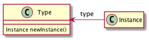
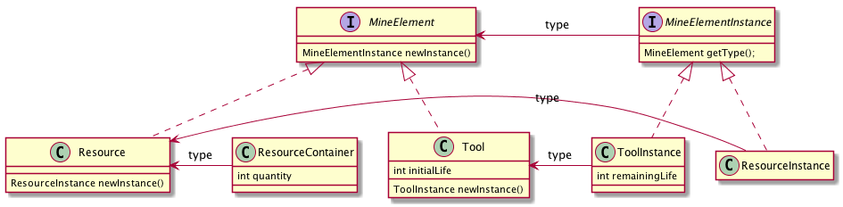
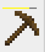
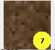

# Flatcraft

Flatcraft est une version simplifiée 2D de MineCraft réalisée en binôme par les étudiants de DUT2 en informatique de Lens.

On utilisera les images disponibles dans la version libre de MineCraft, [Minetest](http://minetest.net/).

Le but de ce projet logiciel est de mettre en pratique les patrons de conception vus durant la seconde année de DUT et de réaliser une application complète en Java/Swing.

Les exercices des semaines précédentes ont permis de poser une base pour la réalisation de ce projet :

- création d'un espace de jeu (une grille contenant des images)
- réaction à des évènements (patron de conception écouteur)
- mise en place du glissé/déplacé

**Aucune base de code Java n'est donnée pour ce projet : chaque groupe piochera dans le code des semaines précédentes les fonctionnalités dont il a besoin. Seuls des exemples ponctuels de code permettant de résoudre un problème particulier seront fournis.**

Certaines fonctionnalités et règles sont obligatoires, et doivent se retrouver dans les projets de chaque groupe.

D'autres sont laissées à l'appréciation de chaque groupe.

Même si le jeu se déroule en 2D, l'idée est d'essayer de réaliser une application avec laquelle on a envie de jouer.

## Semaine 6 : mise en place de la base du jeu

Le but de cette première semaine est de créer l'environnement du jeu : la création des mondes à explorer, et la mise à disposition des ressources et des outils.

### Le monde des ressources

Nous allons considérer un monde en 3D, représenté sur un plan : nous disposons d'une grille de blocs, et chaque bloc peut être "détruit, reposé ou transformé". Pour simplifier le fonctionnement du jeu, on considèrera un monde allant du niveau 0 (la surface de la terre) à un niveau $k$ (la lave). Pour rendre le jeu plus amusant, chaque case pourra avoir une "profondeur" $k$ spécifique, comprise entre 20 et 99.

La carte des ressources fera 30x30 au minimum, et 50x50 au maximum. La carte peut être rectangulaire : le nombre de lignes et le nombre de colonnes doivent être indépendants.

On utilisera les règles suivantes pour créer un monde flatcraft :

- au niveau 0, on trouvera de l'herbe, de l'eau, du bois, de la neige ou du sable
- aux niveaux 1 à 5, on trouvera entre 1 et 5 blocks de boue
- aux niveaux suivants, on trouvera de la pierre, avec dans certains cas du charbon, de l'or, du minerai de fer : plus la profondeur est importante, plus la probabilité de trouver de l'or et du fer doit être importante.
- au niveau k, un bloc de lave indiquera que l'on ne peut pas creuser plus loin.

Chaque ressource sera représentée par un `JButton` particulier, ce qui permettra de facilement récupérer un clic de souris grâce à un écouteur de type `ActionListener`.

On utilisera un clic de souris pour creuser/consommer une ressource et la touche "CTRL" avec un clic de souris pour poser une ressource.

Le code suivant permet de reconnaître cette combinaison de touches :

```java
public void actionPerformed(ActionEvent ae) {
        ...
		if ((ae.getModifiers() & ActionEvent.CTRL_MASK) == ActionEvent.CTRL_MASK) {
		    // déposer
		} else {
		    // creuser
		}
	}
```
	
**Bonus :**

1. générer le monde de telle sorte que sur la surface, la neige, l'eau et le sable ne soient pas des blocks uniques disposés aléatoirement sur la carte.
2. générer le monde de telle sorte que sous la surface, on trouve des "veines" de charbon, d'or ou de minerai de fer

## Représentation des ressources : le patron de conception TypeObject

Il existe un problème particulier pour représenter des ressources sur notre jeu : en effet, chaque "Type" d'élément (herbe, bois, pierre, or) a ses propres caractéristiques (dureté, forme une fois extrait, etc). Une carte est constituée de nombreuses "instances" de ce "type" : quand on trouve plusieurs fois un morceau de bois sur notre carte, le type du bloc est bien du bois, mais il s'agit d'un bloc particulier, qui a ses propres caractéristiques (par exemple combien de fois il a été creusé par l'outil). Une solution naïve serait de créer une seule classe avec toutes ces informations. Cependant, cela provoquerait des duplications d'information : tous les objets représentant un morceau de bois vont devoir connaître l'image représentant un morceau de bois par exemple.

Il existe un patron de conception pour résoudre ce problème : [TypeObject](http://www.cs.ox.ac.uk/jeremy.gibbons/dpa/typeobject.pdf).



Son principe est le suivant : la classe `Type` représente les informations partagées et la classe `Instance` représente les informations spécifiques à l'instance. Une relation unidirectionnelle de `Instance` vers `Type` permet à un objet `Instance` d'avoir accès aux informations communes. De plus, une fabrique dans la classe `Type` contrôle la création des objets de type `Instance`. 

Dans le cas du jeu flatcraft, nous disposons de deux types d'éléments spécifiques : les outils et les ressources. Il faut appliquer le patron de conception à chaque type d'éléments. On obtient par exemple le diagramme de classes suivant :



## Caractéristiques des ressources et des outils

Chaque groupe est libre d'utiliser le mode de gestion des ressources et des outils qui lui convient pour ce jeu.

Il faudra cependant veiller à ce que :

- toutes les ressources ne peuvent pas être creusées (par exemple, la lave)
- toutes les ressources ne peuvent pas être creusées par tous les outils (par exemple, il faut une pioche pour creuser la pierre)
- les outils s'usent

## Des boutons spécifiques pour représenter les outils et les conteneurs de ressources

### Les outils


Les outils ont généralement une durée de vie, qui sera spécifique à chaque type outil. Il est nécessaire de pouvoir visualiser cette durée de vie sur l'outil. Cela se fait généralement par une "barre de vie". Il suffit de redéfinir la méthode `paintComponent` du composant graphique (un `JButton` par exemple) pour rajouter une barre de vie. Le code suivant affiche une barre de vie jaune comme dans l'exemple ci-dessous :



```java
@Override
	protected void paintComponent(Graphics g) {
		if (tool.getCurrentLife() > 0) {
			super.paintComponent(g);
			Rectangle rect = g.getClipBounds();
			g.setColor(Color.GRAY);
			g.fillRect(rect.x+5, rect.y+70, 70, 3);
			g.setColor(Color.YELLOW);
			g.fillRect(rect.x+5, rect.y+70, (int)(tool.getCurrentLife()*70.0)/tool.getType().getInitialLife(), 3);
		}
	}
```

### Les conteneurs de ressources

Dans l'inventaire, les ressources sont stockées dans des "conteneurs". Ces conteneurs ont vocation à recevoir des ressources quand on creuse le terrain et à fournir et récupérer des ressources lors de la phase de transformation. Il existe plusieurs façons de réaliser ces conteneurs.
On supposera simplement que l'on dispose du nombre de ressources disponibles. Le code suivant affiche une pastille jaune indiquant la quantité de ressources (limitée à 2 chiffres, soit 99) comme dans l'exemple ci-dessous :



```java
@Override
	protected void paintComponent(Graphics g) {
		int qty = container.getQuantity();
		if (qty > 0) {
			super.paintComponent(g);
			Rectangle rect = g.getClipBounds();
			g.setColor(Color.YELLOW);
			g.fillOval(rect.x + rect.width - 30, rect.y + rect.height - 30, 30, 30);
			g.setColor(Color.BLACK);
			g.setFont(g.getFont().deriveFont(Font.BOLD, g.getFont().getSize()));
			if (qty < 10) {
				g.drawString(String.valueOf(qty), rect.x + rect.width - 17, rect.y + rect.height - 10);
			} else {
				g.drawString(String.valueOf(qty), rect.x + rect.width - 21, rect.y + rect.height - 10);
			}
		}
	}
```

## Semaine 7 : création de la table de craft

*Utilisation avancée du glissé/déplacé*

## Semaine 8 : analyse automatique du code produit, finitions

*Utilisation de l'analyseur de code SonarQube pour repérer les erreurs et les maladresses dans le code produit.
Création automatique d'un jar autoexécutable pour exécuter le jeu.*

## Résultat attendu

On doit pouvoir jouer à votre jeu.

Une note de fonctionnalité sera établie selon les critères suivants :

- [ ] Il est possible de creuser le monde pour découvrir de nouvelles ressources
- [ ] Il est possible d'utiliser plusieurs outils pour creuser (au moins 2)
- [ ] Il est possible de transformer des ressources pour créer de nouvelles ressources ou outils (table de craft)
- [ ] Il est possible de déposer des ressources sur monde
- [ ] Les ressources sont disposées correctement dans le monde
- [ ]  Le temps nécessaires à l'obtention d'une ressource dépend des ressources et des outils utilisés
- [ ] Aucun bug visible n'apparait lors d'un test rapide de l'application
- [ ] Le fonctionnement de l'application est intuitif (on ne reste jamais bloqué)
- [ ] La gestion des ressources et des outils est avancée

Une note de conception orientée objet sera établie selon les critères suivants :

- [ ] Le principe d'encapsulation est respecté dans toutes les classes
- [ ] La délégation et l'héritage sont utilisés correctement
- [ ] Le polymorphisme est préféré aux structures conditionnelles.
- [ ] Plusieurs patrons de conception sont utilisés (au moins 3 différents)
- [ ] Un diagramme de classe résumant la conception du programme est disponible

Une note de travail collaboratif  sera établie selon les critères suivants :

- [ ] Le dépôt git contient au moins 10 commits, répartis sur les 3 semaines de travail.
- [ ] Les deux membres du binôme sont auteurs de ces commits.
- [ ] Au moins un ticket a été créé et fermé lors du développement.

Une note de présentation complètera cela :

- [ ] Présence d'un texte résumant le fonctionnement spécifique du jeu
- [ ] Code source correctement indenté
- [ ] Commentaires Javadoc pour les méthodes publiques
